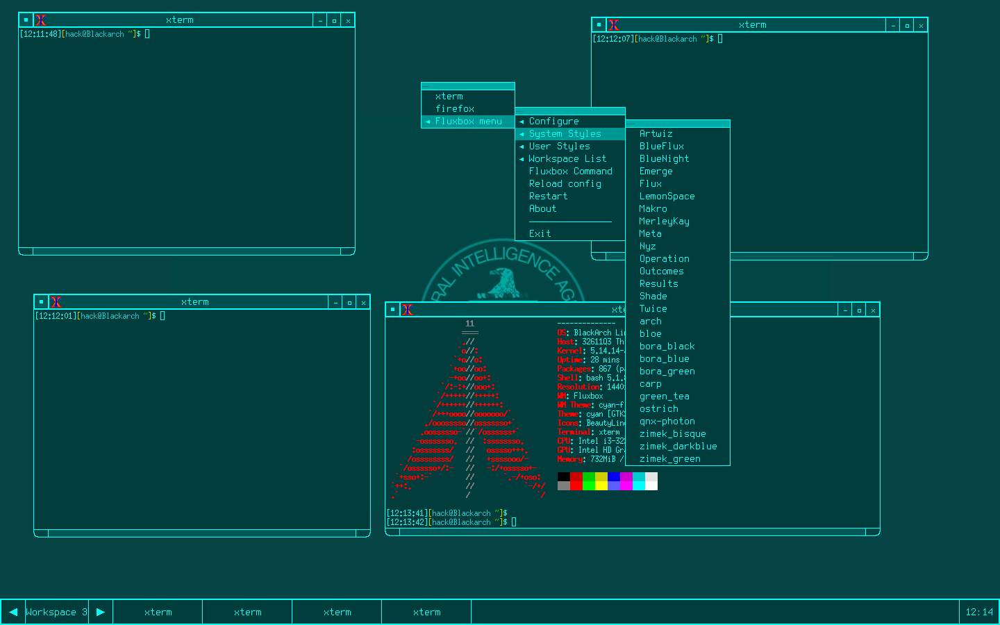
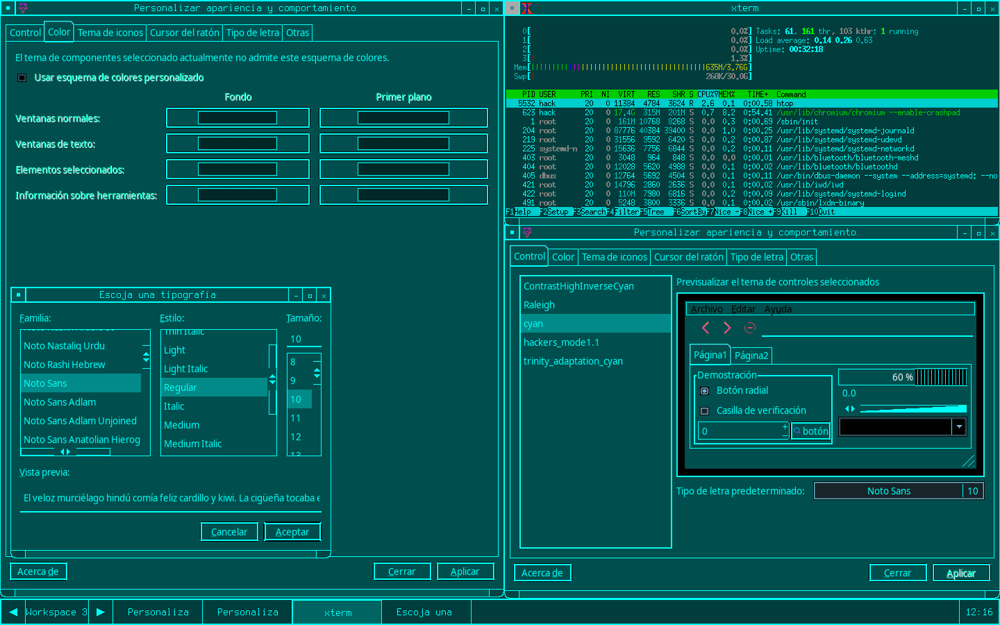

# theme-fluxbox-cyan

# Nota
Para agregar un style a fluxbox tendremos que indicarle nuestra carpeta HOME y en seguida donde se encuentra la configuracion de flubox, Ejemplo:

```shell
cp -r  /home/aqui_va_tu_nombre_de_usuario/.fluxbox/styles/
```

# Theme-fluxbox


##
# Tema GTK2


